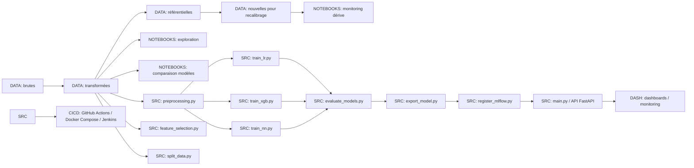

# Credit Scoring ML Platform

## 📌 Présentation du projet

Cette plateforme permet de :

- Entraîner et comparer plusieurs modèles de scoring crédit (Logistic Regression, XGBoost, Neural Network).
- Suivre et détecter les dérives des données et du modèle.
- Déployer un modèle en production via une API FastAPI.
- Industrialiser le modèle avec Docker, CI/CD et MLflow pour le suivi des expérimentations.
- Générer des dashboards de monitoring et de performance via Evidently.

---

## 📞 Structure du projet

```
credit_scoring/
├─ data/                  # Données brutes et transformées
├─ notebooks/             # Notebooks d'exploration, comparaison modèles et monitoring
├─ src/                   # Code source : preprocessing, training, export, API, monitoring
├─ models/                # Modèles sauvegardés (Pickle / ONNX / PMML)
├─ dashboards/            # Dashboards HTML Evidently
├─ tests/                 # Tests unitaires
├─ Dockerfile
├─ docker-compose.yml
├─ entrypoint.sh
├─ requirements.txt
├─ Makefile
├─ config.yaml
├─ logger.py
├─ github_actions.yml
└─ Jenkinsfile
```

---

## ⚡️ Commandes principales

### 1️⃣ Installation des dépendances
```bash
make install
```

### 2️⃣ Build Docker
```bash
make build
```

### 3️⃣ Lancer les tests unitaires
```bash
make test
```

### 4️⃣ Export du modèle
```bash
make export_model
```

### 5️⃣ Enregistrer le modèle dans MLflow
```bash
make register_mlflow
```

### 6️⃣ Lancer l’API FastAPI
```bash
make run_api
```
- API accessible sur : `http://localhost:8000`  
- Docs interactives Swagger : `http://localhost:8000/docs`

### 7️⃣ Générer le dashboard Evidently
```bash
make monitor
```
- Dashboard HTML généré : `dashboards/credit_model_monitoring.html`

### 8️⃣ Déployer l’API Docker localement
```bash
make deploy
```

### 9️⃣ Nettoyer le projet
```bash
make clean
```

---

## 🖼 Diagramme du flux global (Mermaid)



---

## 🧰 CI/CD

- **GitHub Actions** : build, tests et déploiement automatisés.
- **Jenkinsfile (optionnel)** : pipeline équivalente Jenkins.
- **Docker Compose** : orchestration multi-services (API + MLflow + Monitoring).

---

## 📝 Notes

- Modèles exportés en **Pickle, ONNX et PMML** pour compatibilité production.  
- Détection de dérive automatisée via **Evidently** et `retrain_trigger.py`.  
- Logs centralisés via `logger.py`.  
- Paramètres globaux (chemins, hyperparamètres, seuils) dans `config.yaml`.  

---

## 📚 Références

- [FastAPI Documentation](https://fastapi.tiangolo.com/)  
- [MLflow Documentation](https://mlflow.org/docs/latest/index.html)  
- [Evidently Documentation](https://docs.evidentlyai.com/)  
- [XGBoost Documentation](https://xgboost.readthedocs.io/)  
- [Scikit-learn User Guide](https://scikit-learn.org/stable/user_guide.html)

